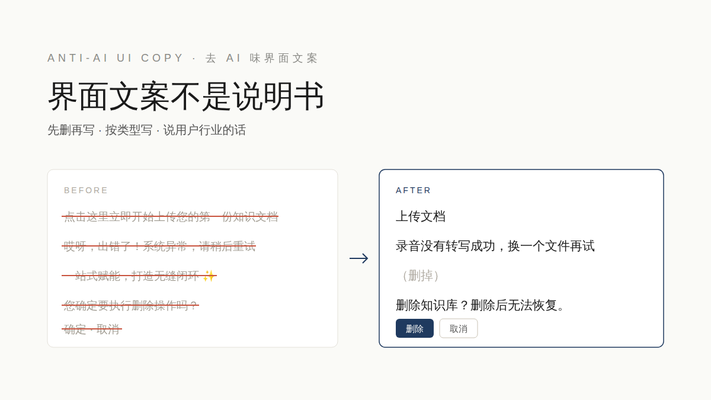

<div align="center">



# 去 AI 味界面文案 · Anti-AI UI Copy

**界面文案不是说明书。先删再写，按类型写，说用户行业的话。**

[](https://github.com/yzfly/skills/releases/latest)
[](https://creativecommons.org/licenses/by-nc/4.0/)
[](https://agentskills.io)

**按钮 · 标题 · 表单 · 空状态 · Toast · 确认弹窗 · 报错 · tooltip · 状态词 · 后端提示**

</div>

---

## 为什么需要它

让 AI 写界面文案，常常得到这样的东西：

- 标题下面一段「本页面基于先进的大模型能力，一站式赋能您的…」
- 按钮写成一句话：「点击这里立即开始创建您的第一个项目」
- 报错只有「操作失败！系统异常」，或者直接把 `500 Internal Server Error` 甩给用户
- 满屏内部术语：节点、链路、落盘、回调、payload
- 「不是简单的 X，而是 Y」「值得注意的是」、破折号、加粗、✨🚀

这个 Skill 让 Agent 像一个做过多年产品的 UX 写作者那样写界面文案：克制、具体、说用户能做什么。

## 它怎么做

| | 规则 | 例子 |
|---|---|---|
| 1 | **先删再写**：说明段、欢迎语、字段旁的解释默认删 | 标题下的介绍段 → 删 |
| 2 | **需要解释的放进问号**：tooltip 一两句，不放报错和按钮 | 长括号解释 → tooltip |
| 3 | **按类型写**：13 类文案各有公式和字数上限 | 确认弹窗：「删除项目？」/「删除后无法恢复。」/「删除 · 取消」 |
| 4 | **说用户行业的话**：先调研同类大厂产品的叫法，建一张用词表 | 话单 → 通话记录；测试集 → 评测集 |
| 5 | **讲结果，不讲原理** | 「系统将通过多轮语义分析…」→「自动找出没答好的句子」 |

另外，它带一份中英文 **AI 味反模式清单**（空洞大词、假对比、铺垫收尾、翻译腔、客服腔、格式滥用……每条都写了什么时候可以保留），以及改代码库时**不能动的字**：程序比较的字符串、i18n 键、发给模型的提示词、人工定稿内容。

## 改写示例

| 位置 | 原文 | 改后 |
|---|---|---|
| 报错 | 哎呀，出错了！系统异常，请稍后重试或联系管理员。(Error: 500 …) | 录音转写失败，文件无法解码，可能已损坏或不是标准 MP3。换一个文件重新上传。 + 按钮「重新上传」 |
| 确认弹窗 | 温馨提示 / 您确定要执行删除操作吗？…请您务必谨慎操作！ / 确定 · 取消 | 删除知识文档？ / 删除后无法恢复，用到它的提示词需要重新生成。 / 删除 · 取消 |
| 空状态 | 抱歉，暂时没有找到符合您筛选条件的数据哦～您可以尝试调整筛选条件… | 没有符合条件的通话记录 + 按钮「清除筛选」 |
| 首页标题 | 一站式 AI 外呼提示词智能生产平台，全方位赋能您的外呼业务 | 从通话录音生成外呼提示词 |

更多见 [`references/examples.md`](references/examples.md)。

## 安装

```bash
npx skills add yzfly/skills@anti-ai-copy -g -y
```

Claude Code 手动安装：

```bash
git clone https://github.com/yzfly/skills.git
cp -r skills/skills/anti-ai-copy ~/.claude/skills/
```

## 用法

```text
用 $anti-ai-copy 把这个页面的文案去 AI 味：<粘贴文案或文件路径>
```

```text
用 $anti-ai-copy 审一遍 src/views/ 下所有界面文案，给我对照表，先别改代码
```

```text
用 $anti-ai-copy 给这个报错写用户能看懂的提示：后端返回 code=QUOTA_EXCEEDED
```

```text
用 $anti-ai-copy 帮我们做一张用词表，产品是 AI 外呼 SaaS，参考腾讯云和扣子的叫法
```

交付物是一张对照表（位置 / 类型 / 原文 / 改后 / 改了什么），直接改代码时另列「没动的字」和原因。

## 依据

规则来自各家官方规范原文，不是凭感觉：

- **中文设计系统**：字节 Semi Design、字节 Arco Design、蚂蚁 Ant Design、腾讯 TDesign
- **英文规范**：Google Material Design、Apple HIG、Microsoft Writing Style Guide、Atlassian Design、Shopify Polaris、GOV.UK、Mailchimp Content Style Guide
- **书与研究**：Steve Krug《Don't Make Me Think》、Kinneret Yifrah《Microcopy: The Complete Guide》、Torrey Podmajersky《Strategic Writing for UX》、Nielsen Norman Group 关于报错、空状态、tooltip、确认弹窗、占位符的研究
- **AI 味识别**：Wikipedia「Signs of AI writing」、Humanizer-zh 等中文社区总结
- **真实产品**：腾讯云智能体开发平台、扣子 / 扣子罗盘（开源词条）、飞书、Stripe、Linear、Notion

每条出处和链接见 [`references/sources.md`](references/sources.md)。

## 和通用「去 AI 味」skill 的区别

通用 humanizer 类 skill 针对文章和帖子：排比、升华、段落节奏。界面文案的 AI 味在别处：讲机制、铺说明、按钮成句、报错空话、内部术语上界面。这个 Skill 只管界面字符串，按文案类型给公式，并知道在代码库里哪些字不能碰。

## 目录

```
anti-ai-copy/
  SKILL.md                        # 五条原则、类型速查、AI 味速查、工作流、禁区、交付格式
  README.md
  LICENSE                         # CC BY-NC 4.0（含 Semi Design MIT 引文声明）
  assets/cover.svg | cover.png
  references/patterns.md          # 15 类文案的写法、对照、边界 + 交付自检清单
  references/ai-tells.md          # 中英文 AI 味反模式清单（带保留条件与出处）
  references/glossary-method.md   # 怎么为产品建用词表：调研行业与大厂叫法
  references/examples.md          # 5 组完整前后对照（中文为主，含英文）
  references/sources.md           # 各家规范要点摘编与链接
```

## 许可

[CC BY-NC 4.0](https://creativecommons.org/licenses/by-nc/4.0/)，商用请联系作者。引用的 Semi Design 规范原文仍按 MIT（Copyright (c) 2021 DouyinFE）；其他规范与书籍仅摘要点并链接原文，版权归原作者。
