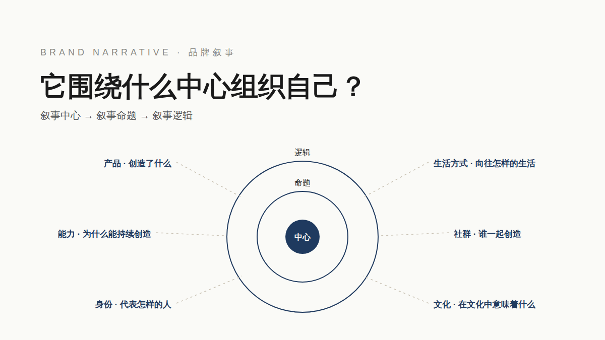

<div align="center">



# 品牌叙事 · Brand Narrative

**美学可以复制，逻辑无法复制。**

[](https://github.com/yzfly/skills/releases/latest)
[](https://creativecommons.org/licenses/by-nc/4.0/)
[](https://agentskills.io)

**六种叙事类型 × 三个构件 · 找到品牌围绕什么运行**

</div>

---

## 品牌到底围绕什么组织自己？

很多品牌做「品牌叙事」，第一反应是把预算投到更好的视觉、更漂亮的包装、更统一的调性。那些是美学。美学可以复制，逻辑无法复制。

这个 Skill 把品牌星球提出的品牌叙事框架装进 Agent：

| 六种叙事类型 | 回答的问题 |
|---|---|
| 产品叙事 | 品牌创造了什么？ |
| 能力叙事 | 品牌为什么能够持续创造？ |
| 身份叙事 | 品牌代表怎样的人？ |
| 生活方式叙事 | 品牌向往怎样的生活？ |
| 社群叙事 | 谁和品牌一起创造？ |
| 文化叙事 | 品牌在文化中意味着什么？ |

每套叙事有三个构件：**叙事中心**（围绕什么运行）、**叙事命题**（持续讨论什么）、**叙事逻辑**（如何延伸到产品、内容、合作与体验）。LEGO 的中心是积木，命题是搭建与创造，逻辑是让一切业务回到搭建、想象和创造。

它会帮你：盘点资产（按功能贴标签，不按名词分类）→ 找 2–3 个中心候选并做具体性 / 延展性 / 排他性测试 → 写出命题与逻辑判断句 → 定主辅叙事与 12 个月阶段策略 → 对任何新品、联名、内容只问一个问题：**放进叙事逻辑里，成不成立？**

## 安装

```bash
npx skills add yzfly/skills@brand-narrative -g -y
```

Claude Code 手动安装：

```bash
git clone https://github.com/yzfly/skills.git
cp -r skills/skills/brand-narrative ~/.claude/skills/
```

## 用法

```text
用 $brand-narrative 帮我们梳理品牌叙事。品牌：____，品类：____，代表产品：____，阶段：0–1
```

```text
用 $brand-narrative 判断一下：我们是做户外装备的，这次和一个咖啡品牌联名，放进我们的叙事里成不成立？
```

```text
用 $brand-narrative，我们一直在讲工厂和专利，用户没感觉，帮我把能力翻译成价值
```

## 交付物

一份品牌叙事文档（模板见 `references/narrative-doc-template.md`）：一页摘要、资产盘点、六类叙事盘点、中心候选测试、主辅分工、12 个月策略、「成不成立」准则与已判断事项、待验证清单。

## 阶段建议

- **0–1**：先验证产品与能力，产品建立认知、能力带来信任。
- **规模化之后**：再构建身份认同、社群关系与文化位置。
- 文化叙事不比产品叙事高级；一个品牌可以用多种叙事，但必须定主次。

## 目录

```
brand-narrative/
  SKILL.md                                  # 框架、输入、六步工作流、边界
  README.md
  LICENSE                                   # CC BY-NC 4.0
  assets/cover.svg | cover.png
  references/six-types.md                   # 六种类型详解与案例摘录
  references/narrative-doc-template.md      # 品牌叙事文档模板
  references/diagnostic-questions.md        # 访谈 / 自查问题清单
```

## 致谢与许可

方法论来源：[品牌星球 Brandstar](https://brandstar.com.cn)《品牌叙事的六种类型》。本 Skill 为方法的工程化整理，案例事实以原文与品牌公开资料为准。CC BY-NC 4.0。
