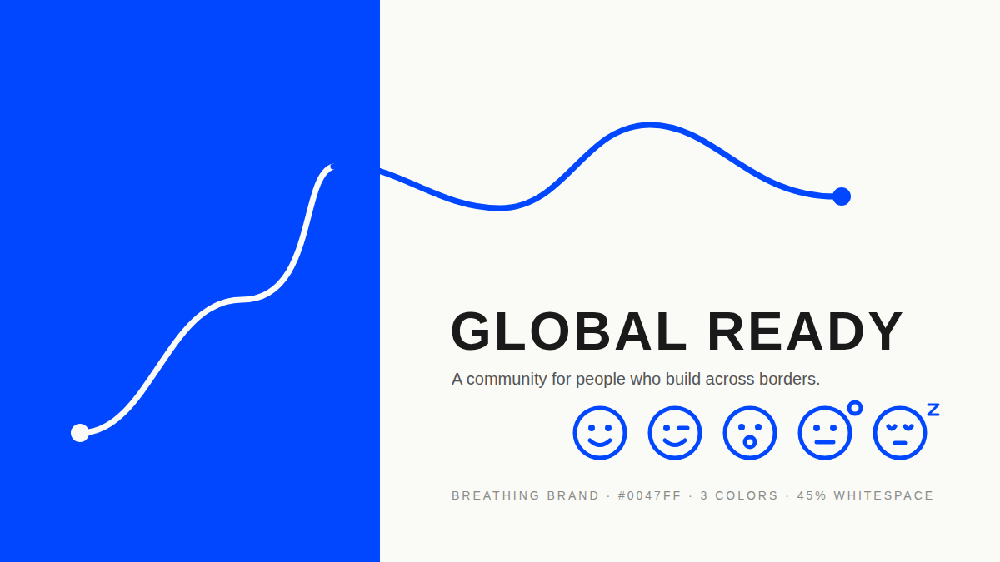

<div align="center">



# 呼吸感品牌全案 · Breathing Brand

**拒绝廉价感。一场对话，产出出海品牌的高级呼吸感视觉全案。**

[](https://github.com/yzfly/skills/releases/latest)
[](https://creativecommons.org/licenses/by-nc/4.0/)
[](https://agentskills.io)

**三个色 · 一根线 · 八个表情 · 六件物料**

</div>

---

## 出海第一步，审美不能输

很多品牌出海看起来有「廉价感」，不是产品差，是**视觉太满、太乱**：五种颜色、三套字体、渐变按钮、满版库存照片。海外用户三秒钟就把你归到「不可信」那一栏。

**呼吸感品牌全案**把一套固定的设计逻辑装进 Agent。你给它品牌名和一句定位，它给你一份能在全球市场建立 3 秒钟顶级信任感的视觉全案：

| 设计逻辑 | 它怎么做 |
|---|---|
| 🔵 **高纯度色块 + 留白** | 全案只有三个色：一个高纯度主色、纸白、深灰。主色块 ≤ 40%，留白 ≥ 45%，写成硬指标 |
| 🔗 **线条即链接** | 品牌唯一的图形语言是一根流动的单线：两个节点、两三次转折，寓意人与组织的点对点链接 |
| 🙂 **灵动 Emoji** | 同一线宽画一套 8 个线条表情，让商业品牌也有温度 |
| 💼 **实战落地** | 独立站首屏、社媒头像封面、名片、帆布袋、PIN、贴纸页，六件物料同一套语言，每件一段可直接生图的提示词 |

出稿前还要过一遍 **12 项反廉价感审查**：渐变、第二个彩色、第三种字体、3D、玻璃拟态、库存人像……任何一项不过就改。

## 安装

```bash
npx skills add yzfly/skills@breathing-brand -g -y
```

Claude Code 手动安装：

```bash
git clone https://github.com/yzfly/skills.git
cp -r skills/skills/breathing-brand ~/.claude/skills/
```

Codex 复制到 `~/.codex/skills/`；WorkBuddy 对它说「帮我安装 yzfly/skills@breathing-brand」。

## 用法

```text
用 $breathing-brand 给「GLOBAL READY 全球创新者社区」做一套出海品牌视觉，定位：出海 · 极简 · 链接
```

```text
用 $breathing-brand，我们是做户外装备出海的，品牌叫 Ridgeline，觉得现在的网站看起来很廉价，帮我重做视觉
```

```text
用 $breathing-brand 只做帆布袋和 PIN 两件周边，主色沿用我们现有的 #FF4F00
```

## 你会拿到什么

1. **全案展示文案**：🟦 品牌 / 🟦 定位 / ✔️ 洞察 / 🎨 设计逻辑 / 💼 实战落地 的社媒版式，直接发小红书、公众号
2. **brand.md**：色彩 token、字体与四级字号、留白硬指标、线条母题规则、8 个 Emoji 画法、物料清单
3. **应用物料**：宿主有图像模型就直接出图，没有就给每件物料的完整提示词；独立站首屏另附栅格结构，可交给 [hallmark](https://github.com/Nutlope/hallmark) 或前端实现
4. **反廉价感审查结果**

## 目录

```
breathing-brand/
  SKILL.md                              # 工作流：洞察 → 色彩留白 → 线条母题 → Emoji → 落地 → 审查 → 交付
  README.md
  LICENSE                               # CC BY-NC 4.0
  assets/cover.svg | cover.png          # 样张：钴蓝 #0047FF、一根线、五个表情
  references/brand-spec-template.md     # brand.md 模板、六个出海安全色、Emoji 画法、展示文案版式
  references/application-prompts.md     # 六件物料的生图提示词 + 追加物料速查
  references/anti-cheap-checklist.md    # 12 项反廉价感审查
```

## 许可

CC BY-NC 4.0。个人与非商业用途自由使用、修改；商用请联系作者。
