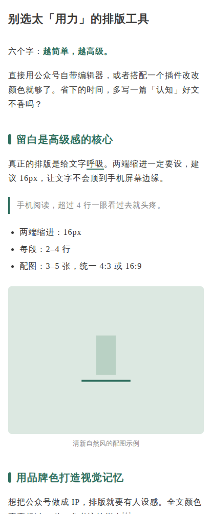

<div align="center">



# 公众号排版 · MP Layout

**越简单，越高级。给文字呼吸，让文章被收藏。**

[](https://github.com/yzfly/skills/releases/latest)
[](LICENSE)
[](https://agentskills.io)

**16px · 行距 1.75 · 字距 1 · 两端 16px · 一种品牌色 · 3–5 张图**

</div>

---

## 它做什么

你写好文章，它负责排版——不用花哨的排版工具，不套模板，只做三件事：

| | 规则 | 它怎么执行 |
|---|---|---|
| 1 | **别选太用力的工具** | 只输出公众号自带编辑器能吃下的内联样式 HTML，粘贴即用 |
| 2 | **留白是高级感的核心** | 正文 16px / 行距 1.75 / 字距 1 / 两端缩进 16px；超过 4 行的段落先拆再排；配图 3–5 张、同风格、统一 4:3 或 16:9 |
| 3 | **用品牌色打造视觉记忆** | 全文只有正文深灰、一种品牌色、一种浅灰；小标题、重点句、引用竖线、分隔符全用品牌色 |

交付前过 8 项排版体检：字号行距、颜色数、段落长度、标题层级、强调数量、配图、外链与 `<style>` 残留、开头钩子与结尾行动。

## 安装

```bash
npx skills add yzfly/skills@mp-layout -g -y
```

Claude Code 手动安装：

```bash
git clone https://github.com/yzfly/skills.git
cp -r skills/skills/mp-layout ~/.claude/skills/
```

## 用法

```text
用 $mp-layout 把这篇文章排成公众号版，品牌色用 #1F3A5F
```

```text
用 $mp-layout 排版，主题是认知成长，帮我挑一个品牌色
```

```text
用 $mp-layout 帮我看看这篇的排版哪里不对
```

也可以直接用脚本，不经过 Agent：

```bash
python3 scripts/md2mp.py article.md --color "#2F6F5E" -o article.html
# 浏览器打开 article.html → 全选复制 → 粘贴进公众号编辑器（电脑端）
```

脚本零依赖，支持标题、段落、加粗、强调、引用、列表、图片（自动加说明）、分隔线；公众号不允许外链，外链会自动转成「文字 + 脚注」。

## 起号设置（直接抄作业）

| 项目 | 值 |
|---|---|
| 正文字号 | 16px |
| 行间距 | 1.75 |
| 字间距 | 1 |
| 两端缩进 | 16 |
| 重点色 | 品牌色（选一个喜欢的，长期不换） |
| 段落 | 每段 2–4 行 |
| 配图 | 3–5 张，统一风格与比例 |
| 颜色 | 全文不超过 3 种 |

品牌色不知道怎么选？`references/brand-colors.md` 按清新自然、认知成长、情感生活、商业职场、科技工具、文化阅读、健康家庭七个主题各给了三个。

## 目录

```
mp-layout/
  SKILL.md                      # 铁律、工作流、排版体检
  README.md
  LICENSE                       # MIT
  scripts/md2mp.py              # Markdown → 公众号内联 HTML（零依赖）
  references/inline-styles.md   # 每个元素的内联样式表
  references/brand-colors.md    # 按主题的品牌色候选
  assets/cover.png              # 排版效果样张
```

## 许可

MIT。
