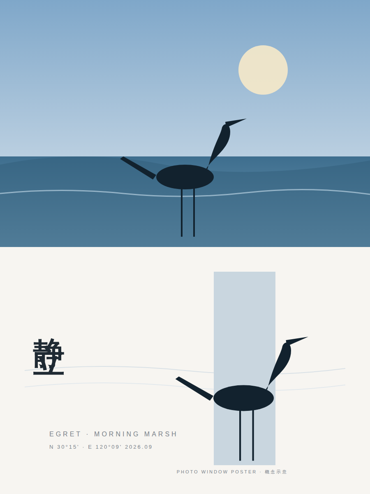

<div align="center">



# 几何情绪窗口海报 · Photo Window Poster

**真实物象穿越几何情绪窗口。上半原图，下半高级海报，每张照片单独成稿。**

[](https://github.com/yzfly/skills/releases/latest)
[](LICENSE)
[](https://agentskills.io)

**3:4 · 上下 1:1 · 一个低饱和几何色块 · 主体越界 · 大留白 · 自动文案**

</div>

---

## 它做什么

上传照片，它按小小东（XXD）的这套提示词出一张高级设计海报：

- **上半**：原照片不动，只做轻微高级调色，可自然扩展天空 / 地面适配画幅。
- **下半**：提取主体、轮廓、姿态与叙事关系，放进一个窄长、低饱和的几何「情绪窗口」——色块方向随主体走势横 / 竖 / 斜，主体局部越界破框；配色从照片提取并柔化为雾蓝、浅青、米白、淡粉、暖灰、浅金；再从画面情绪里提炼一个简短标题和几行细字。

气质：东方留白、现代秩序、自然生命力、高级商业美感。人物、动物、植物、建筑、器物、食物、交通工具、风景都适用。

Skill 在提示词外加了三道工序：**读图**（主体 / 走势 / 主色 / 叙事一句）→ **定窗口与文案**（方向、越界边、窗口色、标题）→ **8 项质检**（上下 1:1、上半不重绘、单一色块、确有越界、留白、同源配色、文字克制、逐张输出）。

## 安装

```bash
npx skills add yzfly/skills@photo-window-poster -g -y
```

Claude Code 手动安装：

```bash
git clone https://github.com/yzfly/skills.git
cp -r skills/skills/photo-window-poster ~/.claude/skills/
```

需要宿主有图像编辑 / 图生图能力（GPT Image、Nano Banana、即梦等）；没有时交付完整提示词与本张判断。

## 用法

```text
用 $photo-window-poster 把这几张照片各做一张海报
```

```text
用 $photo-window-poster，标题用英文，窗口色偏暖
```

## 目录

```
photo-window-poster/
  SKILL.md                    # 版式铁律、六步工作流、质检
  README.md
  LICENSE                     # MIT
  references/prompt.zh-CN.md  # 原始提示词（中文标题版）+ 追加判断示例
  references/prompt.en.md     # 英文标题版
  assets/cover.png            # 概念示意图（SVG 手绘，非模型实际输出）
```

## 致谢

提示词作者：小小东（XXD）。本 Skill 仅做工作流封装，未改动提示词的视觉规则。
