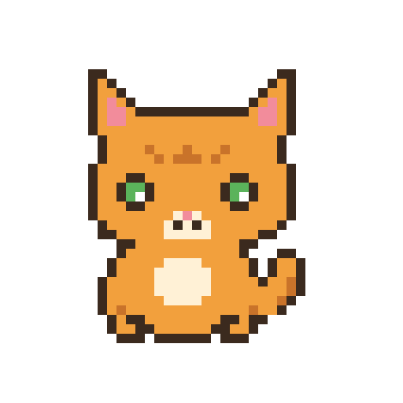

<div align="center">



# 像素精灵 · Pixel Sprite

**把参考图里的主体，一比一转成 32×32 复古游戏像素图标**

[](https://github.com/yzfly/skills/releases/latest)
[](LICENSE)
[](https://agentskills.io)

**不重新设计 · 不换配色 · 只换表现形式**

</div>

---

## 它解决什么问题

让 AI「把这个 logo / 吉祥物 / 猫做成像素风」，十次里有八次会翻车：要么给你一张糊成一片的「像素滤镜」照片，要么顺手把主体重新设计了一遍，耳朵换了、配色换了、姿势也换了。

**像素精灵**把一套经过验证的像素画生成提示词装进 Agent，并加上一道「主体特征卡」工序：先把参考图里主体的造型、比例、姿态、配色、识别元素逐条写下来，再喂给图像模型。结果是：

- 32×32 规格、严格 1 像素网格、硬边像素，没有抗锯齿和渐变
- 6–8 色有限色板，一到两级明暗，经典 8-bit / 16-bit sprite 气质
- 纯白背景、居中单主体，无文字、无边框、无环境
- **参考图里的它，还是它**

适合：App 图标 / favicon、品牌吉祥物、商品小图、社群头像、游戏素材、像素风周边。

## 安装

```bash
npx skills add yzfly/skills@pixel-sprite -g -y
```

Claude Code 手动安装：

```bash
git clone https://github.com/yzfly/skills.git
cp -r skills/skills/pixel-sprite ~/.claude/skills/
```

Codex：复制到 `~/.codex/skills/`；WorkBuddy：对它说「帮我安装 yzfly/skills@pixel-sprite」。

> 出图需要宿主环境有图像生成 / 编辑能力（GPT Image、Nano Banana、即梦等）。没有图像工具时，skill 会交付完整提示词和主体特征卡，粘贴到任意生图工具即可。

## 用法

上传一张图，然后说：

```text
用 $pixel-sprite 把这只猫做成像素图标
```

```text
用 $pixel-sprite 把我们的 logo 转成 16×16 的 favicon，透明背景
```

```text
用 $pixel-sprite 把这三个产品各做一张 32×32 像素图，风格保持一致
```

没有图也行：

```text
用 $pixel-sprite 画一个戴红色围巾的白色小幽灵，32×32
```

## 它是怎么工作的

| 步骤 | 做什么 |
|---|---|
| 1 · 读图 | 写「主体特征卡」：类别、造型比例、姿态朝向、主色辅色、识别元素、必须保留 |
| 2 · 拼提示词 | 特征卡 + 完整技术约束（网格、硬边、色板、背景、无文字）组成最终 prompt |
| 3 · 生成 | 有参考图走图生图，无图走文生图；没有图像工具就交付 prompt |
| 4 · 质检 | 8 项检查：是不是同一个设计、硬边、网格、色数、轮廓、背景、无文字、sprite 气质；不合格重出 |
| 5 · 交付 | 图 + 保留了什么 + 最终 prompt + 可选的尺寸 / 背景 / 动作帧变体 |

## 可调参数

| 参数 | 默认 | 可选 |
|---|---|---|
| 规格 | 32×32 | 16×16、48×48、64×64 |
| 色板 | 6–8 色 | 4–16 色 |
| 背景 | 纯白 | 任意纯色、透明 |
| 数量 | 1 | 多主体逐张生成，共用像素语言 |

## 不做什么

- 不做像素风海报排版、带文字的像素场景、等距 3D 像素城市
- 不做点阵印刷网点海报（那是 halftone，不是 sprite）
- 不做「顺便优化一下造型」——主体设计以参考图为准

## 目录

```
pixel-sprite/
  SKILL.md                    # 技能定义与工作流
  README.md
  LICENSE                     # MIT
  assets/cover.png            # 示例：32×32 手绘像素猫，×12 邻近放大
  references/prompt.zh-CN.md  # 中文生成提示词模板 + 特征卡示例
  references/prompt.en.md     # 英文生成提示词模板
```

## 许可

MIT。提示词模板可自由修改、商用；生成图片的版权取决于你使用的图像模型及其条款。
